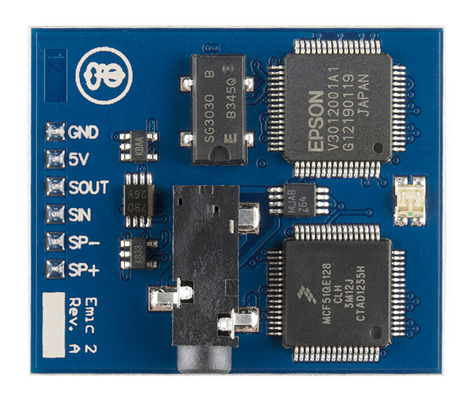

# Zorg Emic

This package makes it possible to control an
[Emic 2 Text-to-Speech Module](https://www.sparkfun.com/products/11711)
using Python.



Image is [CC BY-NC-SA 3.0](http://creativecommons.org/licenses/by-nc-sa/3.0/) from [sparkfun.com](https://www.sparkfun.com)

## About

This module is packages as a driver for [Zorg](https://zorg.github.io/),
a Python framework for robotics and physical computing.

### Asynchronous commands

This module is designed to be non-blocking. Messages are queued before being
sent to the Emic 2 using a worker thread. This allows your code to continue
processing while messages wait for the Emic to transmit the ready signal.

Additionally, the Emic 2 module is only able to receive a maximum of 1023 characters at a time. While this if often a sufficient amount of space for most messages, this library also handles this case by breaking messages over 1023 characters into multiple messages and queuing each of them.

### Character set validation

The Emic 2 module can only speak characters contained within the [ISO-8859-1](https://en.wikipedia.org/wiki/ISO/IEC_8859-1)
(Latin 1) character set. This means that bad things will happen if you try to
send something (such as unicode snowman ⛇⛇⛇) to your Emic. To prevent any possible
issues, this is handled on the software side by this library by throwing an exception
if an invalid character is received.

## Getting Started

Install the package with pip using:

```bash
pip install zorg-emic
```

## Examples

Example Python code can be found in the project repo on GitHub ([zorg-emic/examples](https://github.com/zorg/zorg-emic/tree/master/examples)).

## Resources

1. [Parallax Documentation for the Emic 2 Text-to-Speech Module](https://www.parallax.com/downloads/emic-2-text-speech-module-documentation)
