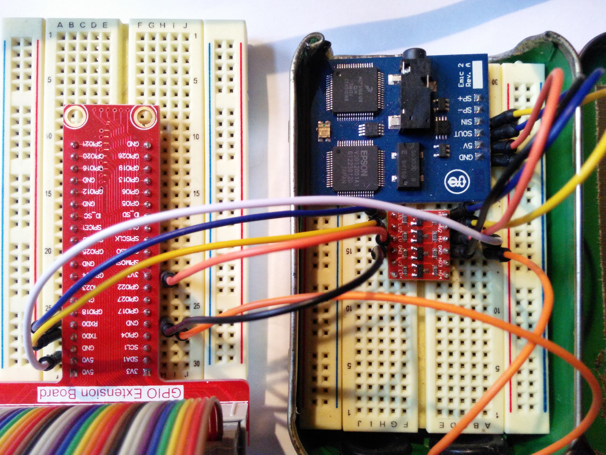
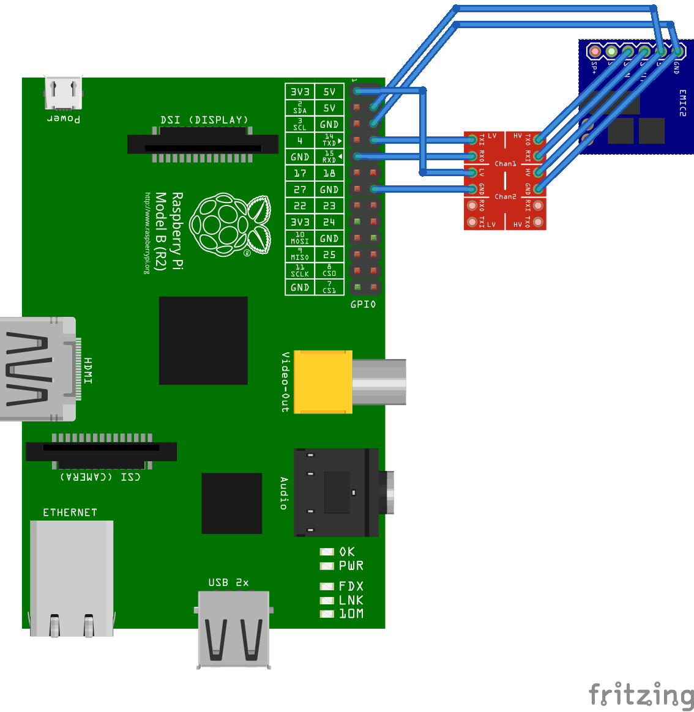

# Using with Raspberry Pi

## Step 0: Logic Levels

The Emic 2 is a 5V device, so a logic level converter is required for the serial connection between the Raspberry Pi and the Emic 2.

This setup has been tested using a logic level converter [sold by Sparkfun](https://www.sparkfun.com/products/12009).

A ribbon cable connector such as the [Pi Wedge](https://www.sparkfun.com/products/13717) is also highly reccomended.

## Step 1: Connect the logic level converter

**Board Connections**

| EMIC2 | Logic HV | Logic LV | Raspberry Pi |
|-------|----------|----------|--------------|
|  GND  |   GND    |   --->   |     GND      |
|  5V   |   HV     |   --->   |     5V       |
|  SOUT |   RXI    |   RXO    |     RXD      |
|  SIN  |   TXO    |   TXI    |     TXD      |
|       |          |   LV     |     3V3      |
|       |          |   GND    |     GND      |

Connect SP- and SP+ to the speaker, or use the Emic's built in audio jack.

## Step 2: Freeing UART on the Raspberry Pi

Adafruit has published [a great guide](https://learn.adafruit.com/adafruit-nfc-rfid-on-raspberry-pi/freeing-uart-on-the-pi) that shows how to do this in detail (it is fairly simple).

The reason you need to free up UART on the Raspberry Pi is because the Pi's RXD and TXD pins are configured to use Linux serial device ttyAMA0 by default. If you need to connect to your Pi over a serial connection to receive console output, then you may want to avoid doing this. 
